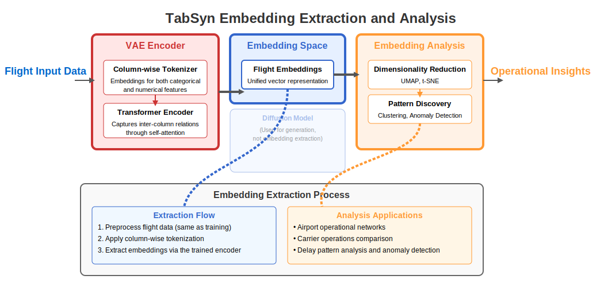

# AeroEmbed: Embeddings for Flight Operations Analysis

A framework for extracting and analyzing embeddings from flight operational data using TabSyn, a mixed-type tabular data synthesizer. This repository demonstrates how latent representations learned during synthetic data generation can be leveraged for operational insights in Air Traffic Management (ATM).

## Overview

AeroEmbed transforms flight operational data (mixed categorical and numerical features) into unified vector representations that capture essential patterns and relationships. The framework provides tools for training TabSyn models on flight data, extracting embeddings, and conducting comprehensive analysis across multiple operational dimensions.


Figure 1 illustrate the practical process for extracting and analyzing TabSyn embeddings. The figure highlights that only the encoder and embedding components are necessary for analysis, while the decoder and diffusion components (used for generation) are not part of the embedding extraction process.

   <div align="center">
     
     <br>◊
     <em>Figure 1: TabSyn Embedding Extraction Process.</em>
   </div>

### Key Capabilities

- **🔧 Data Processing**: Flight data preprocessing pipeline
- **🧠 Model Training**: TabSyn VAE + Diffusion model training with configurable parameters
- **📊 Embedding Extraction**: Extract latent representations from trained models for analysis
- **🌐 Network Analysis**: Airport operational networks via embedding similarity
- **✈️ Operational Patterns**: Route signatures, carrier profiles, and seasonal variations
- **🔍 Anomaly Detection**: Multiple approaches including Isolation Forest and HDBSCAN
- **📈 Temporal Analysis**: Delay patterns, turnaround times, and time-of-day effects
- **🎯 Clustering**: Discover natural operational groupings using density-based methods
- **📉 Dimensionality Analysis**: PCA interpretation and embedding space navigation

This work is part of the SynthAIr project, focused on improving ATM automation through AI-based models.

## Repository Structure

```
├── pyproject.toml                            # Project dependencies and configuration
├── README.md                                 # This file
├── scripts/                                  # Analysis and processing scripts
│   ├── analysis/                             # Embedding analysis tools
│   │   ├── clustering/                       # Clustering and anomaly detection
│   │   │   ├── detect_anomalies.py           # Isolation Forest + HDBSCAN anomaly detection
│   │   │   └── detect_operational_cluster.py # KMeans + HDBSCAN operational clustering
│   │   ├── operational_patterns/             # Operational pattern analysis
│   │   │   ├── analyze_airport_network.py    # Airport similarity networks
│   │   │   ├── analyze_carrier_operations.py # Carrier-specific operational profiles
│   │   │   ├── analyze_route_signatures.py   # Route-specific embedding patterns
│   │   │   └── analyze_seasonal_patterns.py  # Seasonal variation analysis
│   │   └── temporal_analysis/                # Time-based pattern analysis
│   │       ├── analyze_delay_patterns.py     # Delay categorization and patterns
│   │       └── analyze_turnaround_patterns.py # Turnaround time analysis
│   ├── embedding/                            # Core embedding workflows
│   │   ├── extract_embeddings.py             # Extract embeddings from trained models
│   │   ├── generate_synthetic_flights.py     # Generate synthetic data using trained models
│   │   ├── prepare_data.py                   # Flight data preprocessing pipeline
│   │   └── train_tabsyn_model.py             # TabSyn model training
│   └── visualization/                        # Embedding space visualization
│       ├── interpret_pca_components.py       # PCA component interpretation
│       └── navigate_embedding_space.py       # Embedding space navigation
└── src/                                      # Core implementation
    └── aeroembed/
        ├── generators/                       # Generative model implementations
        │   └── tabsyn/                       # TabSyn implementation
        │       ├── data_utils.py             # Data loading and preprocessing utilities
        │       ├── diffusion_utils.py        # Diffusion model utilities
        │       ├── latent_utils.py           # Latent space manipulation
        │       ├── model.py                  # Core TabSyn model architecture
        │       ├── tabsyn.py                 # Main TabSyn interface
        │       ├── transform_module.py       # Data transformation utilities
        │       └── vae/                      # VAE implementation
        │           └── model.py              # VAE model components
        └── preprocessing/                    # Data preprocessing modules
            └── flight_data.py                # Flight-specific preprocessing functions
```

## Installation and Setup

### System Requirements

- Python 3.10 or newer (tested up to Python 3.13)
- CUDA-compatible GPU (recommended for training, 8GB+ VRAM)
- 16GB+ RAM (32GB+ recommended for large datasets)
- Sufficient disk space for models and datasets

### Installation

1. **Install Poetry** (dependency management):
   ```bash
   curl -sSL https://install.python-poetry.org | python3 -
   ```

2. **Clone the repository**:
   ```bash
   git clone https://github.com/SynthAIr/AeroEmbed.git
   cd AeroEmbed
   ```

3. **Install dependencies**:
   ```bash
   poetry install
   ```

4. **Activate the virtual environment**:
   ```bash
   poetry shell
   ```

5. **Verify installation**:
   ```bash
   python -c "import aeroembed; print('Installation successful!')"
   ```

### GPU Setup

For optimal performance, ensure CUDA drivers and PyTorch with CUDA support are properly installed:

```bash
# Check CUDA availability
python -c "import torch; print(f'CUDA available: {torch.cuda.is_available()}')"
```

## Data Preparation

### Flight Data Preprocessing

The framework includes preprocessing for flight operational data. The preprocessing pipeline handles:

- **Data Cleaning**: Filtering invalid records and handling missing values
- **Feature Engineering**: Extracting temporal features, calculating delays and turnaround times
- **Data Validation**: Ensuring data consistency and quality
- **Train/Test Splitting**: Preparing data for model training and evaluation

#### Basic Usage

```bash
python scripts/embedding/prepare_data.py \
  --input_path data/raw_flights.csv \
  --output_train_path data/real/train.csv \
  --output_test_path data/real/test.csv \
  --test_size 0.2 \
  --random_state 42
```


### Expected Data Format

Input data should contain flight operational information with columns such as:

**Required Fields:**
- `IATA_CARRIER_CODE`: Airline carrier code
- `DEPARTURE_IATA_AIRPORT_CODE`: Origin airport code  
- `ARRIVAL_IATA_AIRPORT_CODE`: Destination airport code
- `AIRCRAFT_TYPE_IATA`: Aircraft type code
- `SCHEDULED_DEPARTURE_UTC`: Scheduled departure time
- `SCHEDULED_ARRIVAL_UTC`: Scheduled arrival time
- `DEPARTURE_ACTUAL_OUTGATE_UTC`: Actual departure time
- `ARRIVAL_ACTUAL_INGATE_UTC`: Actual arrival time

**Generated Features:**
- `DEPARTURE_DELAY_MIN`: Departure delay in minutes
- `ARRIVAL_DELAY_MIN`: Arrival delay in minutes
- `TURNAROUND_MIN`: Aircraft turnaround time
- `SCHEDULED_DURATION_MIN`: Scheduled flight duration
- `ACTUAL_DURATION_MIN`: Actual flight duration
- Temporal features: `SCHEDULED_MONTH`, `SCHEDULED_DAY`, `SCHEDULED_HOUR`, `SCHEDULED_MINUTE`

## Model Training

### TabSyn Model Training

Train a TabSyn model on preprocessed flight data:

```bash
python scripts/embedding/train_tabsyn_model.py \
  --train_path data/real/train.csv \
  --model_dir models/flight_tabsyn \
  --vae_epochs 200 \
  --diffusion_epochs 1000 \
  --embedding_dim 4 \
  --batch_size 8192 \
  --device cuda
```

### Training Parameters

| Parameter | Description | Default | Range |
|-----------|-------------|---------|-------|
| `--vae_epochs` | VAE training epochs | 200 | 50-500 |
| `--diffusion_epochs` | Diffusion model epochs | 1000 | 500-2000 |
| `--embedding_dim` | Latent embedding dimension | 4 | 2-16 |
| `--vae_lr` | VAE learning rate | 1e-3 | 1e-4 to 1e-2 |
| `--diffusion_lr` | Diffusion learning rate | 3e-4 | 1e-5 to 1e-3 |
| `--batch_size` | Training batch size | 8192 | 1024-16384 |
| `--max_beta` | Maximum KL annealing weight | 1e-2 | 1e-3 to 1e-1 |
| `--beta_decay` | KL annealing decay rate | 0.7 | 0.5-0.9 |

### Training Monitoring

The training process saves:
- Model checkpoints in `{model_dir}/ckpt/`
- Training parameters in `{model_dir}/training_params.json`
- Preprocessed data in `{model_dir}/data/`
- Training embeddings in `{model_dir}/ckpt/train_z.npy`

## Embedding Extraction

### Extract Embeddings from Trained Models

Extract embeddings from new flight data using a trained TabSyn model:

```bash
python scripts/embedding/extract_embeddings.py \
  --data_path data/new_flights.csv \
  --model_dir models/flight_tabsyn \
  --output_path embeddings/new_flights_embeddings.npy \
  --batch_size 1024 \
  --device cuda
```

### Embedding Format

Extracted embeddings are saved as NumPy arrays with shape `(n_samples, n_tokens, embedding_dim)`:
- `n_samples`: Number of flights
- `n_tokens`: Number of tokens per flight (typically n_features + 1)
- `embedding_dim`: Latent embedding dimension (configured during training)

The CLS token is removed by default. To include it:

```bash
python scripts/embedding/extract_embeddings.py \
  --data_path data/flights.csv \
  --model_dir models/flight_tabsyn \
   --output_path embeddings/flights_with_cls.npy \
   --include_cls_token True \
   --batch_size 1024 \
   --device cuda
```

## Analysis and Visualization

### 1. Clustering Analysis

#### Operational Cluster Detection

Identify natural operational groupings using HDBSCAN and KMeans:

```bash
python scripts/analysis/clustering/detect_operational_cluster.py \
  --embeddings embeddings/flights_embeddings.npy \
  --data data/real/train.csv \
  --output-dir results/clustering \
  --min-cluster-size 2200 \
  --sample-size 100000
```

**Outputs:**
- Cluster visualizations with operational metrics
- 3D PCA projections of clusters
- Cluster statistics and route analysis
- CSV files with cluster assignments

#### Anomaly Detection

Compare Isolation Forest and HDBSCAN for anomaly detection:

```bash
python scripts/analysis/clustering/detect_anomalies.py \
  --embeddings embeddings/flights_embeddings.npy \
  --data data/real/train.csv \
  --output-dir results/anomalies \
  --contamination 0.05 \
  --sample-size 100000
```

**Outputs:**
- Comparative anomaly detection visualizations
- Method agreement analysis
- Anomaly statistics and metadata

### 2. Operational Pattern Analysis

#### Airport Network Analysis

Generate airport similarity networks based on embedding similarity:

```bash
python scripts/analysis/operational_patterns/analyze_airport_network.py \
  --embeddings embeddings/flights_embeddings.npy \
  --data data/real/train.csv \
  --output-dir results/airport_network \
  --threshold 0.90 \
  --sample-size 500000
```

**Outputs:**
- Airport network graph with community detection
- Similarity matrices and node/edge statistics
- Network analysis CSV files

#### Carrier Operations Analysis

Compare operational profiles across airlines:

```bash
python scripts/analysis/operational_patterns/analyze_carrier_operations.py \
  --embeddings embeddings/flights_embeddings.npy \
  --data data/real/train.csv \
  --output-dir results/carrier_analysis \
  --top-carriers 6 \
  --sample-size 200000
```

**Outputs:**
- Carrier-specific embedding visualizations
- Performance metrics comparison
- Density contour analysis

#### Route Signature Analysis

Analyze route-specific operational patterns:

```bash
python scripts/analysis/operational_patterns/analyze_route_signatures.py \
  --embeddings embeddings/flights_embeddings.npy \
  --data data/real/train.csv \
  --output-dir results/route_analysis \
  --top-routes 6 \
  --perplexity 30
```

**Outputs:**
- t-SNE projections of route embeddings
- Route performance statistics
- Route-specific delay patterns

#### Seasonal Pattern Analysis

Examine seasonal variations in flight operations:

```bash
python scripts/analysis/operational_patterns/analyze_seasonal_patterns.py \
  --embeddings embeddings/flights_embeddings.npy \
  --data data/real/train.csv \
  --output-dir results/seasonal_analysis \
  --sample-size 100000
```

**Outputs:**
- Monthly embedding pattern visualizations
- Seasonal performance metrics
- Statistical comparison tables

### 3. Temporal Analysis

#### Delay Pattern Analysis

Analyze delay patterns across different categories:

```bash
python scripts/analysis/temporal_analysis/analyze_delay_patterns.py \
  --embeddings embeddings/flights_embeddings.npy \
  --data data/real/train.csv \
  --output-dir results/delay_analysis \
  --sample-size 200000
```

**Outputs:**
- Delay category clustering in embedding space
- Delay distribution analysis
- Hourly delay patterns

#### Turnaround Pattern Analysis

Examine turnaround time patterns and relationships:

```bash
python scripts/analysis/temporal_analysis/analyze_turnaround_patterns.py \
  --embeddings embeddings/flights_embeddings.npy \
  --data data/real/train.csv \
  --output-dir results/turnaround_analysis \
  --sample-size 200000
```

**Outputs:**
- Turnaround category analysis
- Turnaround-delay correlation analysis
- Hourly turnaround patterns

### 4. Embedding Space Visualization

#### PCA Component Interpretation

Interpret the meaning of principal components in embedding space:

```bash
python scripts/visualization/interpret_pca_components.py \
  --embeddings embeddings/flights_embeddings.npy \
  --data data/real/train.csv \
  --output-dir results/pca_analysis \
  --n-components 6 \
  --sample-size 100000
```

**Outputs:**
- PCA component correlation visualizations
- Component interpretation analysis
- Variance explained statistics

#### Embedding Space Navigation

Explore directional patterns in embedding space:

```bash
python scripts/visualization/navigate_embedding_space.py \
  --embeddings embeddings/flights_embeddings.npy \
  --data data/real/train.csv \
  --output-dir results/navigation \
  --sample-size 100000
```

**Outputs:**
- Feature direction visualizations
- Embedding space navigation maps
- Gradient analysis of operational factors

## Synthetic Data Generation

Generate synthetic flight data using trained TabSyn models:

```bash
python scripts/embedding/generate_synthetic_flights.py \
  --model_dir models/flight_tabsyn \
  --output_path synthetic/flights_10k.csv \
  --num_samples 10000 \
  --steps 50
```


## Limitations and Considerations

### Model Limitations

- **Prediction Ceiling**: Flight delay prediction typically achieves R² ≤ 0.30 due to external factors
- **Schedule Dependency**: Embeddings reflect schedule information, not real-time operational conditions
- **Data Bias**: Models reflect patterns in training data, may not generalize to different operational contexts

### Analysis Limitations

- **Embedding Interpretability**: Latent dimensions are abstract and may not have direct operational meaning
- **Temporal Snapshots**: Analyses represent static patterns, not dynamic operational evolution
- **Categorical Boundaries**: Embedding space boundaries may not align with operational decision boundaries

### Operational Considerations

Flight operations are inherently stochastic, influenced by factors not captured in schedule data:
- Weather conditions
- Air traffic control interventions
- Crew availability and connections
- Aircraft maintenance requirements
- Passenger-related delays


## Attributions and Acknowledgments

This repository is part of the SynthAIr project that has received funding from the SESAR Joint Undertaking under grant agreement No 101114847 under European Union's Horizon 2020 research and innovation programme.

The implementation builds upon:

- **TabSyn**: Based on "Mixed-Type Tabular Data Synthesis with Score-based Diffusion in Latent Space" by Zhang et al.

### Code Adaptations

The repository incorporates code adapted from:

1. **TabSyn** (https://github.com/amazon-science/tabsyn) by Amazon Science

All adapted code contains attribution notices acknowledging the original source and license.

## License

This repository is licensed under the Creative Commons Attribution-ShareAlike 4.0 International License (CC BY-SA 4.0).

The repository incorporates components with the following licenses:
- TabSyn: Apache License 2.0


Users should consult the full license texts for specific use cases, particularly for commercial applications.